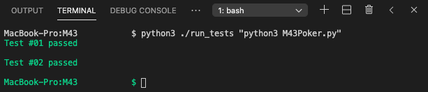

#### Source Code of my program: 
- `M43Poker.py`
#### Language of my program writted in: 
- Python3

---

#### Steps to Run Program:

> Please make sure to execute below steps from the directory where the `M43Poker.py` file, `run_tests` script, and tests directory are located
1. open VS Code 
1. Activate terminal and point to this directory folder
1. run this command in terminal: 
    ```py
    python3 ./run_tests "python3 M43Poker.py"
    ```
1. Below is an example of running the command in terminal in directory folder "M43" where my files are located in:

    
---

### Design Decisions:

- I am using the Object Oriented Design and Programming to easily manage Card, Hand, Player, and Game into objects and for data encapsulation.
- I am using a scoring system for the various hand types, with a special tweak for evaluating Pair hand's scoring.  This allows the program to quickly identify the player(s) with the best ranked hand(s).  Detail of the scoring is in the calcScore() method inside the Hand object.
- I am converting the card's ranking to numeric values to help compare the ranking easily and quickly.
- I have included input validation checks for below scenarios.  Game Rule Exception will be thrown when these validations fail.
    - duplicate player id
    - incorrect input values for suit or rank
    - the number of players beyond 1 to 23 inclusively
    

---

### Known Limitations:

This program is designed such that:
- each input file must be named with numeric number only and located in the tests directory folder for a successful run.
- each input file portrays one game with N different number of players.  Each player has one hand to play the game.  Having duplicate players/player ids will trigger a Game Rule Exception.
- each input file must have at least one player and no more than 23 players in each game/file. Including no player or more than 23 players will trigger a Game Rule Exception.
- each card representation must contain `h`, `d`, `s`, or `c` only as suit.  Any other letters and in upper case will trigger a Game Rule Exception.
- each card representation must contain an interger `2` to `9` or `T`, `J`, `Q`, `K`, or `A` only as rank.  Any other numbers, letters and in lower case will trigger a Game Rule Exception.

---

### Known Bugs:

- This program expects the input file to correctly provide the play card representations for each game, i.e., each game is expected to play on one traditional deck of 52 cards.  There is no validation on duplicate cards of the same suit and ranking in a game.
